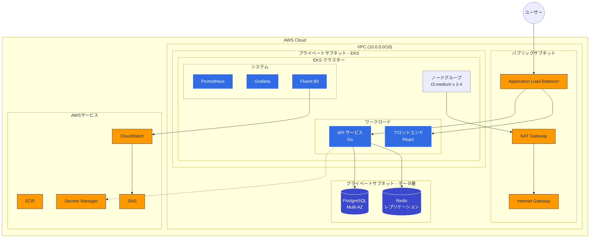
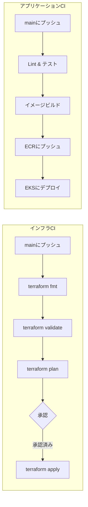

# AWS EKS インフラストラクチャ（Terraform）

タスク管理アプリケーション向けの本番対応EKSインフラストラクチャ。Terraformモジュールとデプロイメントによる構築。

## 目次

- [アーキテクチャ](#アーキテクチャ)
- [機能](#機能)
- [技術スタック](#技術スタック)
- [プロジェクト構成](#プロジェクト構成)
- [セットアップ](#セットアップ)
- [モジュール詳細](#モジュール詳細)
- [CI/CDパイプライン](#cicdパイプライン)
- [監視・オブザーバビリティ](#監視オブザーバビリティ)
- [セキュリティ](#セキュリティ)
- [技術選定理由](#技術選定理由)

## アーキテクチャ



## 機能

- **マルチAZ高可用性**: 3つのAZにまたがるVPCと冗長コンポーネント
- **オートスケーリング**: EKSノードグループとPodのHPA
- **セキュリティ**: プライベートサブネット、セキュリティグループ、IRSA、暗号化ストレージ
- **オブザーバビリティ**: Prometheus + Grafana + Fluent Bit + CloudWatch
- **CI/CD**: GitHub Actionsによるインフラとアプリケーションのデプロイ
- **Infrastructure as Code**: 環境分離されたモジュラーTerraform構成

## 技術スタック

| カテゴリ | 技術 |
|----------|------|
| IaC | Terraform 1.5+ |
| コンテナオーケストレーション | Amazon EKS 1.29 |
| データベース | Amazon RDS PostgreSQL 15 |
| キャッシュ | Amazon ElastiCache Redis 7 |
| コンテナレジストリ | Amazon ECR |
| ロードバランサー | AWS ALB（AWS Load Balancer Controller経由） |
| 監視 | Prometheus, Grafana, CloudWatch |
| ログ | Fluent Bit → CloudWatch Logs |
| CI/CD | GitHub Actions |
| シークレット管理 | AWS Secrets Manager |

## プロジェクト構成

```
.
├── modules/                    # 再利用可能なTerraformモジュール
│   ├── vpc/                    # VPC、サブネット、NAT Gateway
│   ├── eks/                    # EKSクラスター、ノードグループ、IRSA
│   ├── rds/                    # PostgreSQL Multi-AZ
│   ├── elasticache/            # Redisレプリケーショングループ
│   ├── ecr/                    # コンテナレジストリ
│   └── monitoring/             # CloudWatch、SNSアラート
│
├── environments/               # 環境別設定
│   ├── dev/                    # 開発環境
│   ├── prod/                   # 本番環境
│   └── backend/                # Terraformステートバックエンド
│
├── k8s/                        # Kubernetesマニフェスト
│   ├── base/                   # 基本アプリケーションリソース
│   │   ├── api/                # APIサービス（Deployment, Service, HPA）
│   │   └── frontend/           # フロントエンドサービス
│   ├── monitoring/             # オブザーバビリティスタック
│   │   ├── prometheus-stack-values.yaml
│   │   ├── fluent-bit-values.yaml
│   │   └── grafana-dashboard-*.yaml
│   └── chaos/                  # カオスエンジニアリングテスト
│
├── apps/                       # アプリケーションソースコード
│   ├── api/                    # Go APIサービス
│   └── frontend/               # Reactフロントエンド
│
│
└── .github/workflows/          # CI/CDパイプライン
    ├── terraform-ci.yml        # インフラCI
    ├── api-ci.yml              # APIビルド＆デプロイ
    └── frontend-ci.yml         # フロントエンドビルド＆デプロイ
```

## セットアップ

### 前提条件

- 適切な認証情報が設定されたAWS CLI
- Terraform >= 1.5
- kubectl
- Helm 3

### デプロイ手順

1. **Terraformバックエンドの初期化**
   ```bash
   cd environments/backend
   terraform init && terraform apply
   ```

2. **インフラストラクチャのデプロイ**
   ```bash
   cd environments/dev  # または prod
   terraform init
   terraform plan
   terraform apply
   ```

3. **kubectlの設定**
   ```bash
   aws eks update-kubeconfig --name <cluster-name> --region ap-northeast-1
   ```

4. **Kubernetesリソースのデプロイ**
   ```bash
   kubectl apply -k k8s/base/
   ```

## モジュール詳細

### VPCモジュール
- パブリック/プライベートサブネット分離のマルチAZ VPC
- プライベートサブネットのインターネットアクセス用NAT Gateway
- EKSノードとデータ層（RDS/Redis）用の専用サブネット
- ネットワーク監視用VPC Flow Logs

### EKSモジュール
- オートスケーリング対応のマネージドノードグループ
- IRSA（IAM Roles for Service Accounts）用OIDCプロバイダー
- コアアドオン: VPC CNI, CoreDNS, kube-proxy
- AWS Load Balancer ControllerとCluster Autoscaler用IAMロール

### RDSモジュール
- PostgreSQL Multi-AZデプロイメント
- 自動バックアップと保存時暗号化
- パフォーマンス向けパラメータグループ設定
- AWS Secrets Managerでのシークレット管理

### ElastiCacheモジュール
- 自動フェイルオーバー対応Redisレプリケーショングループ
- 転送中および保存時の暗号化
- キャッシュメトリクス用CloudWatchアラーム

### Monitoringモジュール
- アラート通知用SNSトピック
- 主要メトリクスのCloudWatchダッシュボード
- ログ転送用Fluent Bit IAMロール

## CI/CDパイプライン



### ワークフロー一覧

| ワークフロー                   | トリガー                   | 説明               |
| ------------------------ | ---------------------- | ---------------- |
| `terraform-ci.yml`       | `main`へのプッシュ、PR        | インフラの検証とデプロイ     |
| `api-ci.yml`             | `apps/api/**`への変更      | APIのビルド、テスト、デプロイ |
| `frontend-ci.yml`        | `apps/frontend/**`への変更 | フロントエンドのビルドとデプロイ |
| `slack-notification.yml` | ワークフロー完了時              | デプロイ通知           |

## 監視・オブザーバビリティ

### メトリクススタック
- **Prometheus**: メトリクス収集と保存
- **Grafana**: 可視化ダッシュボード
  - Golden Signalsダッシュボード（レイテンシ、トラフィック、エラー、飽和度）
  - SLI/SLOダッシュボード

### ログスタック
- **Fluent Bit**: Podからのログ収集
- **CloudWatch Logs**: 集中ログ保存と分析

### アラート
- アプリケーションアラート用PrometheusRule
- インフラメトリクス用CloudWatch Alarms
- 通知ルーティング用SNS

## セキュリティ

- **ネットワーク分離**: ワークロードとデータ用プライベートサブネット
- **IRSA（IAM Roles for Service Accounts）**: Podごとの細かい権限制御
- **シークレット管理**: 自動ローテーション対応のAWS Secrets Manager
- **暗号化**: RDS、ElastiCache、EBSの保存時暗号化
- **セキュリティグループ**: 最小権限のネットワークアクセスルール

## 技術選定理由

### なぜTerraformモジュール構成か？
モジュラーアーキテクチャにより以下を実現：
- 環境間（dev/prod）での再利用性
- 一貫したリソース設定
- テストとメンテナンスの容易さ

### なぜマルチAZか？
- 本番ワークロードの高可用性
- RDSとElastiCacheの自動フェイルオーバー
- AZ障害への耐性

### なぜCloudWatch Container InsightsではなくPrometheusか？
- PromQLによる豊富なクエリ機能
- カスタムダッシュボードとアラートルール
- オープンソースエコシステムとの互換性
- 大規模運用時のコスト効率

### なぜFluentdではなくFluent Bitか？
- 低リソース消費
- Kubernetes環境に最適化
- CloudWatchネイティブ出力プラグイン

---

## ライセンス

MIT

## 作成者

saji2
