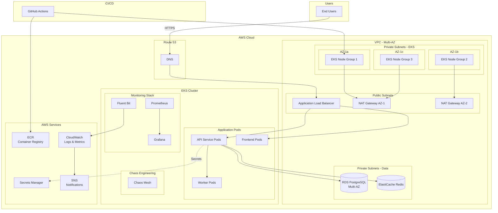

# SREポートフォリオプロジェクト - システム構成

## アーキテクチャ概要



---

## ネットワーク構成

### VPC設計

#### CIDR ブロック
- **VPC CIDR**: `10.0.0.0/16`

#### サブネット構成（3 AZ）

| サブネット種別 | AZ | CIDR | 用途 |
|--------------|-----|------|------|
| Public Subnet 1 | ap-northeast-1a | 10.0.1.0/24 | ALB, NAT Gateway |
| Public Subnet 2 | ap-northeast-1c | 10.0.2.0/24 | ALB, NAT Gateway |
| Public Subnet 3 | ap-northeast-1d | 10.0.3.0/24 | ALB |
| Private Subnet 1 (EKS) | ap-northeast-1a | 10.0.11.0/24 | EKS Worker Nodes |
| Private Subnet 2 (EKS) | ap-northeast-1c | 10.0.12.0/24 | EKS Worker Nodes |
| Private Subnet 3 (EKS) | ap-northeast-1d | 10.0.13.0/24 | EKS Worker Nodes |
| Private Subnet 4 (Data) | ap-northeast-1a | 10.0.21.0/24 | RDS, ElastiCache |
| Private Subnet 5 (Data) | ap-northeast-1c | 10.0.22.0/24 | RDS, ElastiCache |

#### ルーティング

**Public Subnets**:
- `0.0.0.0/0` → Internet Gateway

**Private Subnets (EKS)**:
- `0.0.0.0/0` → NAT Gateway (各AZ)
- VPC内通信 → Local

**Private Subnets (Data)**:
- VPC内通信のみ → Local

---

## EKS クラスタ構成

### クラスタ仕様

- **Kubernetes Version**: 1.28
- **Cluster Name**: `sre-portfolio-cluster`
- **Endpoint Access**: Public + Private
- **Cluster Add-ons**:
  - VPC CNI
  - CoreDNS
  - kube-proxy
  - AWS Load Balancer Controller

### ノードグループ

#### Primary Node Group
- **インスタンスタイプ**: t3.medium (2 vCPU, 4 GB RAM)
- **最小ノード数**: 2
- **最大ノード数**: 6
- **希望ノード数**: 3
- **AMI**: Amazon Linux 2
- **ディスク**: 20 GB gp3
- **スケーリング**: Cluster Autoscaler

#### ノード配置
- Multi-AZ配置（3 AZ）
- Pod Disruption Budget 設定
- Node Affinity/Anti-Affinity

---

## Kubernetes リソース構成

### Namespace 設計

```yaml
namespaces:
  - app-production      # アプリケーション本番環境
  - monitoring          # Prometheus, Grafana
  - chaos-engineering   # Chaos Mesh
  - ingress-nginx       # Ingress Controller (オプション)
```

### アプリケーションデプロイメント

#### API Service

```yaml
apiVersion: apps/v1
kind: Deployment
metadata:
  name: api-service
  namespace: app-production
spec:
  replicas: 3
  strategy:
    type: RollingUpdate
    rollingUpdate:
      maxSurge: 1
      maxUnavailable: 0
  template:
    spec:
      containers:
      - name: api
        image: <ECR_URI>/api-service:latest
        resources:
          requests:
            cpu: 200m
            memory: 256Mi
          limits:
            cpu: 500m
            memory: 512Mi
        livenessProbe:
          httpGet:
            path: /health
            port: 8080
          initialDelaySeconds: 30
          periodSeconds: 10
        readinessProbe:
          httpGet:
            path: /ready
            port: 8080
          initialDelaySeconds: 5
          periodSeconds: 5
```

#### Frontend Service

```yaml
apiVersion: apps/v1
kind: Deployment
metadata:
  name: frontend-service
  namespace: app-production
spec:
  replicas: 2
  template:
    spec:
      containers:
      - name: frontend
        image: <ECR_URI>/frontend-service:latest
        resources:
          requests:
            cpu: 100m
            memory: 128Mi
          limits:
            cpu: 200m
            memory: 256Mi
```

### Horizontal Pod Autoscaler (HPA)

```yaml
apiVersion: autoscaling/v2
kind: HorizontalPodAutoscaler
metadata:
  name: api-service-hpa
  namespace: app-production
spec:
  scaleTargetRef:
    apiVersion: apps/v1
    kind: Deployment
    name: api-service
  minReplicas: 3
  maxReplicas: 10
  metrics:
  - type: Resource
    resource:
      name: cpu
      target:
        type: Utilization
        averageUtilization: 70
  - type: Resource
    resource:
      name: memory
      target:
        type: Utilization
        averageUtilization: 80
```

### Service & Ingress

```yaml
apiVersion: v1
kind: Service
metadata:
  name: api-service
  namespace: app-production
spec:
  type: ClusterIP
  ports:
  - port: 80
    targetPort: 8080
  selector:
    app: api-service
---
apiVersion: networking.k8s.io/v1
kind: Ingress
metadata:
  name: app-ingress
  namespace: app-production
  annotations:
    alb.ingress.kubernetes.io/scheme: internet-facing
    alb.ingress.kubernetes.io/target-type: ip
    alb.ingress.kubernetes.io/healthcheck-path: /health
spec:
  ingressClassName: alb
  rules:
  - host: api.sre-portfolio.example.com
    http:
      paths:
      - path: /
        pathType: Prefix
        backend:
          service:
            name: api-service
            port:
              number: 80
  - host: app.sre-portfolio.example.com
    http:
      paths:
      - path: /
        pathType: Prefix
        backend:
          service:
            name: frontend-service
            port:
              number: 80
```

---

## データベース構成

### RDS PostgreSQL

#### 仕様
- **エンジン**: PostgreSQL 15
- **インスタンスクラス**: db.t3.micro
- **ストレージ**: 20 GB gp3
- **Multi-AZ**: 有効
- **自動バックアップ**: 7日間保持
- **暗号化**: 有効

#### 接続情報
- **エンドポイント**: Secrets Manager で管理
- **ポート**: 5432
- **データベース名**: `taskmanager`

#### スキーマ設計

```sql
-- Users Table
CREATE TABLE users (
    id SERIAL PRIMARY KEY,
    username VARCHAR(50) UNIQUE NOT NULL,
    email VARCHAR(100) UNIQUE NOT NULL,
    password_hash VARCHAR(255) NOT NULL,
    created_at TIMESTAMP DEFAULT CURRENT_TIMESTAMP,
    updated_at TIMESTAMP DEFAULT CURRENT_TIMESTAMP
);

-- Tasks Table
CREATE TABLE tasks (
    id SERIAL PRIMARY KEY,
    user_id INTEGER REFERENCES users(id) ON DELETE CASCADE,
    title VARCHAR(200) NOT NULL,
    description TEXT,
    status VARCHAR(20) DEFAULT 'TODO',
    priority VARCHAR(20) DEFAULT 'MEDIUM',
    due_date TIMESTAMP,
    created_at TIMESTAMP DEFAULT CURRENT_TIMESTAMP,
    updated_at TIMESTAMP DEFAULT CURRENT_TIMESTAMP
);

-- Indexes
CREATE INDEX idx_tasks_user_id ON tasks(user_id);
CREATE INDEX idx_tasks_status ON tasks(status);
CREATE INDEX idx_tasks_due_date ON tasks(due_date);
```

### ElastiCache Redis

#### 仕様
- **エンジン**: Redis 7.0
- **ノードタイプ**: cache.t3.micro
- **レプリケーション**: 1 primary + 1 replica
- **自動フェイルオーバー**: 有効

#### 用途
- セッション管理
- APIレスポンスキャッシュ
- レート制限カウンター

---

## 監視・ログ構成

### Prometheus + Grafana

#### Prometheus設定

**収集メトリクス**:
- Kubernetes クラスタメトリクス（kube-state-metrics）
- ノードメトリクス（node-exporter）
- アプリケーションメトリクス（カスタムメトリクス）
- コンテナメトリクス（cAdvisor）

**保持期間**: 15日間

#### Grafana ダッシュボード

1. **Cluster Overview**
   - ノード数、Pod数
   - CPU/Memory使用率
   - ネットワークトラフィック

2. **Application Dashboard**
   - Request Rate
   - Error Rate
   - Response Time (P50, P95, P99)
   - Active Connections

3. **Database Dashboard**
   - Connection Pool
   - Query Performance
   - Slow Queries

4. **SLI/SLO Dashboard**
   - Availability
   - Latency
   - Error Budget

### Fluent Bit → CloudWatch Logs

#### ログ収集
- アプリケーションログ
- Kubernetesイベントログ
- システムログ

#### ログストリーム構成
```
/aws/eks/sre-portfolio-cluster/application/api-service
/aws/eks/sre-portfolio-cluster/application/frontend-service
/aws/eks/sre-portfolio-cluster/system/kube-system
```

### CloudWatch Alarms

#### 主要アラート

| アラート名 | メトリクス | 閾値 | アクション |
|----------|---------|------|---------|
| High CPU Usage | CPUUtilization | > 80% for 5 min | SNS通知 |
| High Memory Usage | MemoryUtilization | > 85% for 5 min | SNS通知 |
| High Error Rate | 5xx Errors | > 5% for 3 min | SNS通知 |
| Low Availability | HealthyHostCount | < 2 for 2 min | SNS通知 |
| RDS High Connections | DatabaseConnections | > 80 | SNS通知 |
| API Latency | TargetResponseTime | > 500ms (P95) | SNS通知 |

---

## セキュリティ構成

### IAM Roles

#### EKS Cluster Role
- AmazonEKSClusterPolicy
- AmazonEKSVPCResourceController

#### EKS Node Role
- AmazonEKSWorkerNodePolicy
- AmazonEC2ContainerRegistryReadOnly
- AmazonEKS_CNI_Policy

#### IRSA (IAM Roles for Service Accounts)

**API Service**:
- Secrets Manager読み取り
- CloudWatch Logs書き込み
- S3アクセス（必要に応じて）

### Security Groups

#### ALB Security Group
- Inbound: 443 (HTTPS) from 0.0.0.0/0
- Outbound: All to EKS Node SG

#### EKS Node Security Group
- Inbound: All from ALB SG
- Inbound: All from same SG (Node間通信)
- Outbound: All

#### RDS Security Group
- Inbound: 5432 from EKS Node SG
- Outbound: None

#### ElastiCache Security Group
- Inbound: 6379 from EKS Node SG
- Outbound: None

### Secrets Management

**Secrets Manager に保存**:
- RDS接続情報（エンドポイント、ユーザー名、パスワード）
- Redis接続情報
- JWT Secret Key
- 外部API キー（必要に応じて）

**Kubernetes Secrets**:
- External Secrets Operator 使用
- Secrets Manager と同期

### Pod Security

```yaml
apiVersion: v1
kind: PodSecurityPolicy
metadata:
  name: restricted
spec:
  privileged: false
  allowPrivilegeEscalation: false
  requiredDropCapabilities:
    - ALL
  runAsUser:
    rule: MustRunAsNonRoot
  seLinux:
    rule: RunAsAny
  fsGroup:
    rule: RunAsAny
  readOnlyRootFilesystem: true
```

---

## CI/CD パイプライン

### GitHub Actions ワークフロー

#### Build & Push

```yaml
name: Build and Push
on:
  push:
    branches: [main]
    
jobs:
  build:
    runs-on: ubuntu-latest
    steps:
      - uses: actions/checkout@v3
      
      - name: Configure AWS credentials
        uses: aws-actions/configure-aws-credentials@v2
        with:
          role-to-assume: ${{ secrets.AWS_ROLE_ARN }}
          aws-region: ap-northeast-1
      
      - name: Login to ECR
        uses: aws-actions/amazon-ecr-login@v1
      
      - name: Build and push
        run: |
          docker build -t $ECR_REGISTRY/$ECR_REPOSITORY:$IMAGE_TAG .
          docker push $ECR_REGISTRY/$ECR_REPOSITORY:$IMAGE_TAG
      
      - name: Update Kubernetes manifests
        run: |
          kubectl set image deployment/api-service \
            api=$ECR_REGISTRY/$ECR_REPOSITORY:$IMAGE_TAG
```

#### デプロイ戦略
- **Blue-Green Deployment** または **Canary Deployment**
- 自動ロールバック機能
- Smoke Test 実行

---

## Terraform ディレクトリ構成

```
terraform/
├── environments/
│   ├── dev/
│   │   ├── main.tf
│   │   ├── variables.tf
│   │   └── terraform.tfvars
│   └── prod/
│       ├── main.tf
│       ├── variables.tf
│       └── terraform.tfvars
├── modules/
│   ├── vpc/
│   │   ├── main.tf
│   │   ├── variables.tf
│   │   └── outputs.tf
│   ├── eks/
│   │   ├── main.tf
│   │   ├── variables.tf
│   │   └── outputs.tf
│   ├── rds/
│   │   ├── main.tf
│   │   ├── variables.tf
│   │   └── outputs.tf
│   ├── elasticache/
│   │   ├── main.tf
│   │   ├── variables.tf
│   │   └── outputs.tf
│   └── monitoring/
│       ├── main.tf
│       ├── variables.tf
│       └── outputs.tf
└── backend.tf
```

---

## コスト最適化戦略

### 1. スポットインスタンス活用
- ワーカーノードの50%をスポットインスタンスに
- 推定コスト削減: 30-40%

### 2. リソーススケジューリング
- 夜間（22:00-8:00）: ノード数を最小化
- 週末: 開発環境停止

### 3. ストレージ最適化
- gp3 使用（gp2より20%安価）
- 不要なスナップショット削除

### 4. ログ保持期間最適化
- CloudWatch Logs: 7日間保持
- S3アーカイブ: 必要に応じて

---

## 災害復旧（DR）計画

### バックアップ戦略

#### RDS
- 自動バックアップ: 毎日
- 保持期間: 7日間
- スナップショット: 週次手動

#### Kubernetes
- Velero によるクラスタバックアップ
- 設定ファイルのGit管理

### 復旧手順

#### RTO (Recovery Time Objective)
- **目標**: 1時間以内

#### RPO (Recovery Point Objective)
- **目標**: 1時間以内（最新バックアップから）

#### 復旧ステップ
1. Terraform でインフラ再構築
2. RDS スナップショットから復元
3. Kubernetes クラスタ再構築
4. アプリケーションデプロイ
5. DNS切り替え

---

## 次のアクション

### 即座に開始可能な作業

1. **リポジトリ作成**
   ```bash
   mkdir sre-portfolio-project
   cd sre-portfolio-project
   git init
   ```

2. **Terraform初期化**
   ```bash
   mkdir -p terraform/{modules,environments/dev}
   cd terraform
   terraform init
   ```

3. **アプリケーション選定**
   - Go + Gin (推奨) または Python + FastAPI
   - React または Vue.js

4. **Day 1 タスク開始**
   - VPC作成
   - EKS クラスタ構築
   - 基本的なネットワーク設定
